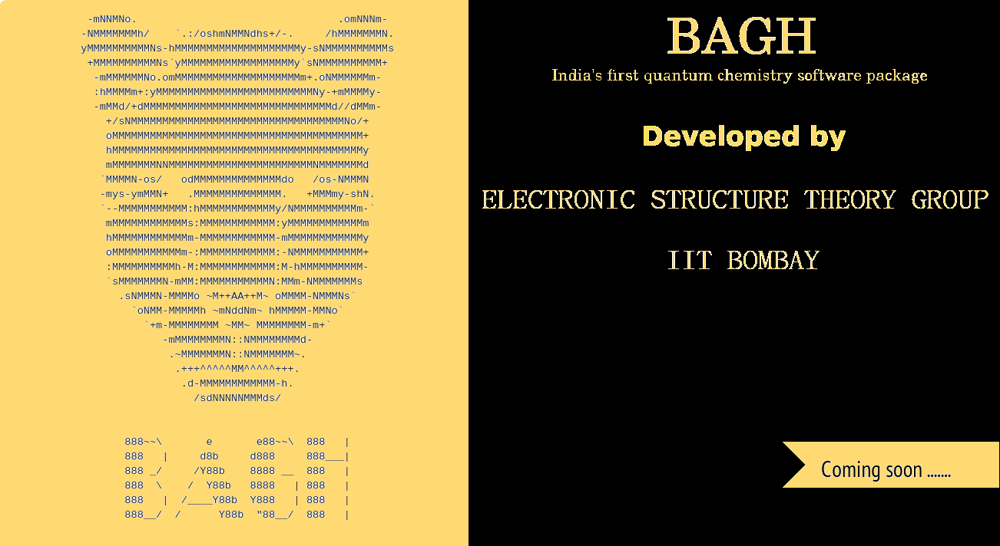

Welcome to Bagh's documentation!
===================================

**Bagh**  is a Python library for Quantum chemistry calculation
that solves quantum chemistry problems.
It pulls data from the  `CCB  database <https://cccbdb.nist.gov//>`_
and offers a *simple* and *intuitive* API.

Check out the :doc:`usage` section for further information, including
how to :ref:`installation` the project.

.. note::

   This project is under active development.

Contents
--------

.. toctree::

   usage
   api
   test
   getting_started 
   computational_options
   contact_information
   team
